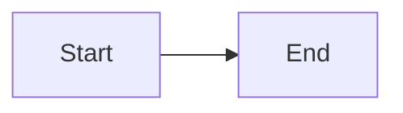
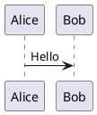

# CLAUDE.md

This file provides guidance to Claude Code (claude.ai/code) when working with code in this repository.

## Project Overview

This is a Python-based static site generator inspired by Foam, designed to create knowledge bases with graph visualization, full-text search, and bidirectional linking from markdown files.

## Core Commands

### Build Site
```bash
python foam-ssg.py /path/to/notes -o /path/to/output
```

### Build and Serve Locally
```bash
python foam-ssg.py /path/to/notes --serve
```

### Install Dependencies
```bash
pip install -r requirements.txt
```

### Setup PlantUML (Optional)
```bash
chmod +x plantuml-setup.sh
./plantuml-setup.sh
# After setup, ensure PlantUML is in PATH:
export PATH="$HOME/foam-ssg-tools:$PATH"
# Or add to your shell profile: echo 'export PATH="$HOME/foam-ssg-tools:$PATH"' >> ~/.bashrc
```

## Running Foam SSG

### Activation and Execution
- To run Foam SSG:
  - Activate virtual environment: `source .venv/bin/activate`
  - Set PATH for PlantUML (if installed): `export PATH="$HOME/foam-ssg-tools:$PATH"`
  - Build site: `python foam-ssg.py /path/to/notes -o /path/to/output`
  - Build and serve locally: `python foam-ssg.py /path/to/notes --serve`

### Optional PlantUML Setup
- Install PlantUML support by running: `./plantuml-setup.sh`

## Architecture

The project is built around the `FoamSSG` class in `foam-ssg.py` with these key components:

### Core Processing Pipeline
1. **Note Processing** (`process_notes`): Parses markdown files with frontmatter, extracts wiki-style links `[[note]]` and `[[note|alias]]`
2. **Graph Building**: Uses NetworkX to create bidirectional link graph
3. **Content Transformation**: Converts markdown to HTML with special handling for diagrams and wiki links
4. **Template Rendering**: Uses Jinja2 to generate HTML pages with embedded D3.js graph visualization

### Key Methods
- `extract_links()`: Parses `[[wiki-link]]` syntax from markdown content
- `process_wiki_links()`: Converts wiki links to HTML, marks broken links
- `process_diagrams()`: Handles Mermaid (client-side) and PlantUML (pre-rendered) diagrams
- `remove_link_reference_sections()`: Removes `[//begin]` and `[//end]` sections for markdown compatibility
- `get_full_graph_data()`: Generates complete graph data for D3.js visualization

### Template Architecture
The HTML template includes:
- **Sidebar with 3 tabs**: Graph (D3.js force-directed), Search (client-side), Links (bidirectional)
- **Main content area**: Rendered markdown with processed wiki links
- **Embedded JavaScript**: D3.js for graph, search functionality, Mermaid for diagrams

## File Structure

```
foam-ssg/
├── foam-ssg.py           # Main static site generator
├── foam-ssg-extended.py  # Extended version with additional features
├── requirements.txt      # Python dependencies
├── plantuml-setup.sh    # PlantUML installation script
├── foam-ssg-readme.md   # Full documentation
└── example-notes.md     # Example note structure
```

## Development Notes

- **Dependencies**: markdown, frontmatter, jinja2, networkx, beautifulsoup4, pygments
- **Diagram Support**: Mermaid renders client-side, PlantUML pre-renders at build time as PNG images
- **Link Processing**: Wiki links are bidirectional - `[[target]]` creates both outgoing link from source and backlink to target
- **Search**: Client-side search using JavaScript, index generated at build time
- **Graph Visualization**: D3.js force-directed graph showing all notes, current note highlighted in blue, connected notes in green

## Wiki Link Format

- `[[Note Title]]` - Basic wiki link
- `[[Note Title|Display Text]]` - Wiki link with custom display text
- `[[Note Title#Heading]]` - Link to specific heading within a note
- Links automatically create bidirectional relationships in the graph

## Link Reference Sections

The system supports markdown compatibility by ignoring `[//begin]` and `[//end]` sections used by other parsers:

```markdown
[//begin]: # "Autogenerated link references"
[link in document|renamed link]: <title name with spaces> "title name with spaces"
[link]: noSpaceName "noSpaceName"
[//end]: # "Autogenerated link references"
```

These sections are automatically removed during markdown processing to ensure clean output.

## Diagram Support

### Mermaid (Client-side)
```markdown

```

### PlantUML (Pre-rendered)
```markdown

```

## Environment Notes

- The environment is currently installed with uv
- Running `source .venv/bin/activate` is necessary to activate the uv environment

## Commit Tracking
- Committed project initial architecture and core documentation

## Development Guidelines
- Commit changes when you have completed your TODO list.