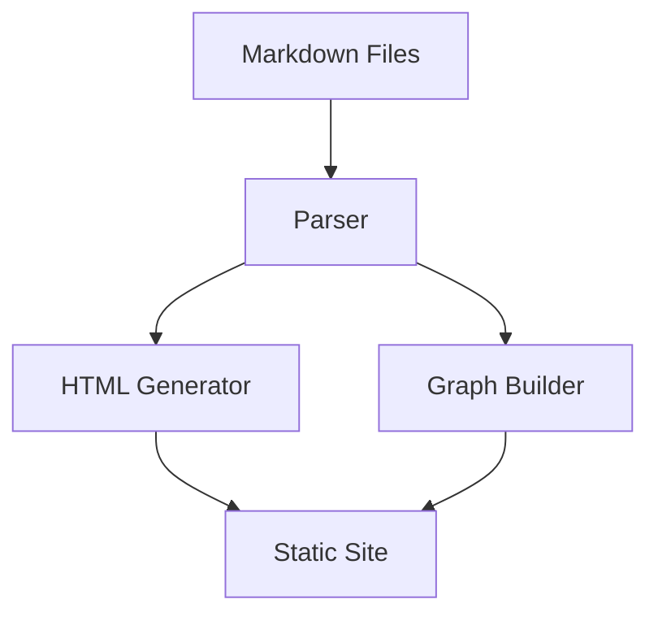
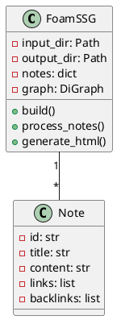
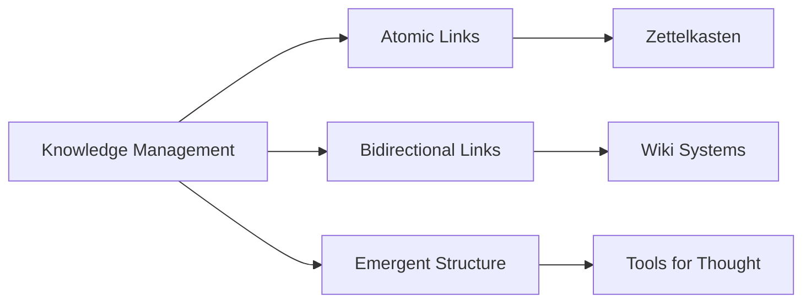

# Example Foam Notes Structure

Create these files in your notes directory to test the static site generator:

## notes/index.md
```markdown
---
title: Welcome to My Knowledge Base
date: 2024-01-20
tags: [index, getting-started]
---

# Welcome to My Knowledge Base

This is my personal knowledge base built with Foam SSG. It contains notes on various topics I'm learning and thinking about.

## Quick Links

- [[programming/python-tips|Python Tips & Tricks]]
- [[daily/2024-01-20|Today's Notes]]
- [[projects/foam-ssg|Building This Site]]

## Recent Thoughts

I've been exploring how to better organize my thoughts and knowledge. This tool helps me create a web of interconnected ideas.

Check out my [[ideas/knowledge-management]] note for more thoughts on this topic.
```

## notes/programming/python-tips.md
```markdown
---
title: Python Tips & Tricks
tags: [programming, python]
---

# Python Tips & Tricks

Collection of useful Python patterns and snippets.

## List Comprehensions

Python's list comprehensions are powerful. See [[programming/functional-python]] for more functional programming patterns.

```python
# Filter and transform in one go
squared_evens = [x**2 for x in numbers if x % 2 == 0]
```

## Useful Libraries

- **requests**: For HTTP requests
- **pandas**: Data manipulation (see [[data-science/pandas-guide]])
- **pytest**: Testing framework

Related: [[programming/javascript-tips|JavaScript Tips]]
```

## notes/projects/foam-ssg.md
```markdown
---
title: Building a Foam-Style SSG
tags: [projects, web-development]
---

# Building a Foam-Style SSG

This project implements a static site generator inspired by [[tools/foam|Foam]] and [[tools/obsidian|Obsidian]].

## Features

### Graph Visualization



### Architecture



## Implementation Details

The system parses [[concepts/markdown]] files, extracts [[concepts/wiki-links]], and builds a graph of connections.

See [[programming/python-tips]] for implementation patterns used.
```

## notes/daily/2024-01-20.md
```markdown
---
title: Daily Note - 2024-01-20
date: 2024-01-20
tags: [daily]
---

# Daily Note - 2024-01-20

## Today's Tasks

- [x] Set up [[projects/foam-ssg|Foam SSG]]
- [x] Write documentation
- [ ] Test with real notes
- [ ] Deploy to GitHub Pages

## Thoughts

Working on building a knowledge management system. The key insight is that [[ideas/knowledge-management|knowledge is a graph]], not a hierarchy.

## Links

- Previous: [[daily/2024-01-19]]
- Next: [[daily/2024-01-21]]
```

## notes/ideas/knowledge-management.md
```markdown
---
title: Thoughts on Knowledge Management
tags: [ideas, productivity]
---

# Thoughts on Knowledge Management

Knowledge forms a web, not a tree. Traditional folder structures fail to capture the interconnected nature of ideas.

## Key Principles

1. **Bidirectional Links**: When A links to B, B should know about A
2. **Emergence**: Structure emerges from connections, not imposed hierarchy
3. **Atomic Notes**: Each note should contain one idea

## Tools

- [[tools/foam]]: VS Code extension
- [[tools/obsidian]]: Desktop app
- [[projects/foam-ssg]]: My static site generator

## Visual Representation



Related: [[concepts/zettelkasten]], [[concepts/personal-knowledge-management]]
```

## Directory Structure

```
notes/
├── index.md
├── programming/
│   ├── python-tips.md
│   ├── javascript-tips.md
│   └── functional-python.md
├── projects/
│   └── foam-ssg.md
├── daily/
│   ├── 2024-01-19.md
│   ├── 2024-01-20.md
│   └── 2024-01-21.md
├── ideas/
│   └── knowledge-management.md
├── concepts/
│   ├── markdown.md
│   ├── wiki-links.md
│   ├── zettelkasten.md
│   └── personal-knowledge-management.md
└── tools/
    ├── foam.md
    └── obsidian.md
```