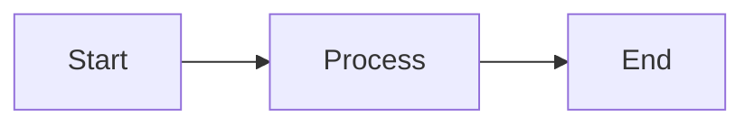
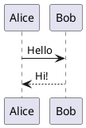

# Foam Static Site Generator

A Python-based static site generator inspired by Foam bubble notes, featuring full graph visualization, full-text search, bidirectional links, and diagram support.

## Features

✨ **Full Graph Visualization**: Interactive node graph showing ALL notes and their connections (like Foam)
  - Zoom and pan support
  - Current note highlighted in blue
  - Connected notes highlighted in green
  - Hover tooltips showing note titles
🔍 **Full-Text Search**: Client-side search across all notes (like GitHub 1s)
🔗 **Bidirectional Links**: Track both incoming and outgoing links with dedicated sidebar
📊 **Diagram Support**: 
  - Mermaid diagrams (rendered client-side, no setup needed)
  - PlantUML diagrams (pre-rendered at build time as images)
🖼️ **Image Support**: Standard markdown image rendering
🎨 **Dark Theme**: Modern VS Code-inspired dark interface
⚡ **Fast**: Static generation with client-side interactivity
🌐 **No Server Required**: Generated site is completely static

## Installation

```bash
# Clone or download the foam_ssg.py file
# Install dependencies
pip install -r requirements.txt

# For PlantUML support (optional but recommended)
# Run the setup script:
chmod +x setup_plantuml.sh
./setup_plantuml.sh

# Or install manually:
# 1. Install Java: https://www.java.com/download/
# 2. Download PlantUML: https://plantuml.com/download
# 3. Make sure 'plantuml' command is available in your PATH
```

## Usage

### Basic Usage

```bash
# Build your site
python foam_ssg.py /path/to/your/notes

# Build and serve locally
python foam_ssg.py /path/to/your/notes --serve

# Specify output directory
python foam_ssg.py /path/to/your/notes -o /path/to/output
```

### Note Format

Your markdown files should follow this format:

```markdown
---
title: My Note Title
tags: [tag1, tag2]
date: 2024-01-15
---

# My Note

This is a note with a [[wiki link]] to another note.

You can also use [[link|custom text]] for the link.

## Mermaid Diagram



## PlantUML Diagram



## Images


```

### Wiki Links

- `[[Note Title]]` - Link to another note
- `[[Note Title|Display Text]]` - Link with custom display text
- Links are automatically tracked for bidirectional linking

### Directory Structure

```
your-notes/
├── index.md
├── projects/
│   ├── project1.md
│   └── project2.md
├── daily/
│   ├── 2024-01-15.md
│   └── 2024-01-16.md
└── images/
    └── diagram.png
```

Output structure:
```
_site/
├── index.html
├── projects/
│   ├── project1.html
│   └── project2.html
├── daily/
│   ├── 2024-01-15.html
│   └── 2024-01-16.html
├── images/
│   └── diagram.png
├── diagrams/
│   └── [generated PlantUML images]
└── search-index.json
```

## Interface Features

### Sidebar Tabs

1. **Graph Tab**: Interactive force-directed graph showing note connections
   - Click nodes to navigate
   - Drag nodes to rearrange
   - Current note highlighted in blue

2. **Search Tab**: Full-text search across all notes
   - Real-time search as you type
   - Shows title and content preview
   - Click results to navigate

3. **Links Tab**: Shows bidirectional links for current note
   - Outgoing links (notes this page links to)
   - Incoming links (notes that link to this page)

### Customization

You can customize the appearance by modifying the CSS in the template within `foam_ssg.py`. Key areas:

- Color scheme variables
- Graph node styling
- Typography settings
- Layout dimensions

## Advanced Features

### PlantUML Pre-Rendering

PlantUML diagrams are pre-rendered during the build process:
1. Install PlantUML using the setup script or manually
2. During build, all PlantUML code blocks are converted to PNG images
3. Images are stored in the `diagrams/` folder
4. The generated site displays the images - no server required
5. If PlantUML is not installed, diagrams show as code blocks with a note

### Graph Visualization

The graph shows ALL notes in your knowledge base:
- Full zoom and pan support
- Current note highlighted in blue
- Notes connected to current note highlighted in green
- Hover over nodes to see note titles
- Click nodes to navigate
- Graph controls for zoom in/out and reset

### Extending the Generator

The generator is designed to be extensible:

- Add new markdown extensions in `__init__`
- Modify graph visualization in `get_full_graph_data`
- Enhance search functionality in `get_search_data`
- Add new diagram processors in `process_diagrams`

## Tips

1. **Performance**: For large note collections, consider implementing:
   - Incremental builds (only rebuild changed files)
   - Parallel processing for markdown conversion
   - Graph layout caching for faster rendering

2. **Organization**: 
   - Use folders to organize notes by topic
   - Create an index.md as your home page
   - Use consistent naming for wiki links

3. **Diagrams**:
   - Mermaid diagrams render client-side (no setup needed)
   - PlantUML pre-renders at build time for better quality and no runtime dependencies
   - Both diagram types work offline once the site is built

4. **Graph Navigation**:
   - Use mouse wheel or pinch to zoom
   - Drag to pan around the graph
   - Click and drag nodes to rearrange
   - The graph layout automatically adjusts to show all notes

## Troubleshooting

**Broken Links**: Links appear in red strikethrough when target note doesn't exist

**PlantUML Not Rendering**: Check that PlantUML is installed and accessible via command line. Run `plantuml -version` to verify.

**Search Not Working**: Ensure JavaScript is enabled in your browser

**Graph Too Dense**: Use zoom controls to navigate large graphs. The force-directed layout will space nodes appropriately.

## License

MIT License - Feel free to modify and distribute

## Contributing

Contributions welcome! Some ideas for enhancement:
- Tags support and filtering
- RSS feed generation
- Theme customization
- Export to other formats
- Git integration for history