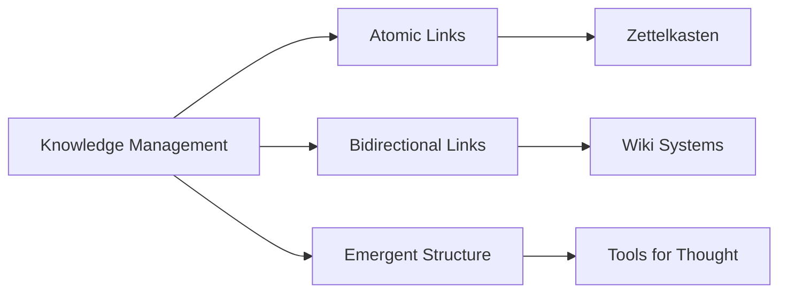

# Thoughts on Knowledge Management

Knowledge forms a web, not a tree. Traditional folder structures fail to capture the interconnected nature of ideas.

## Key Principles

1. **Bidirectional Links**: When A links to B, B should know about A
2. **Emergence**: Structure emerges from connections, not imposed hierarchy
3. **Atomic Notes**: Each note should contain one idea

## Tools

- [[tools/foam]]: VS Code extension
- [[tools/obsidian]]: Desktop app
- [[projects/foam-ssg]]: My static site generator

## Visual Representation

Related: [[concepts/zettelkasten]], [[concepts/personal-knowledge-management]]