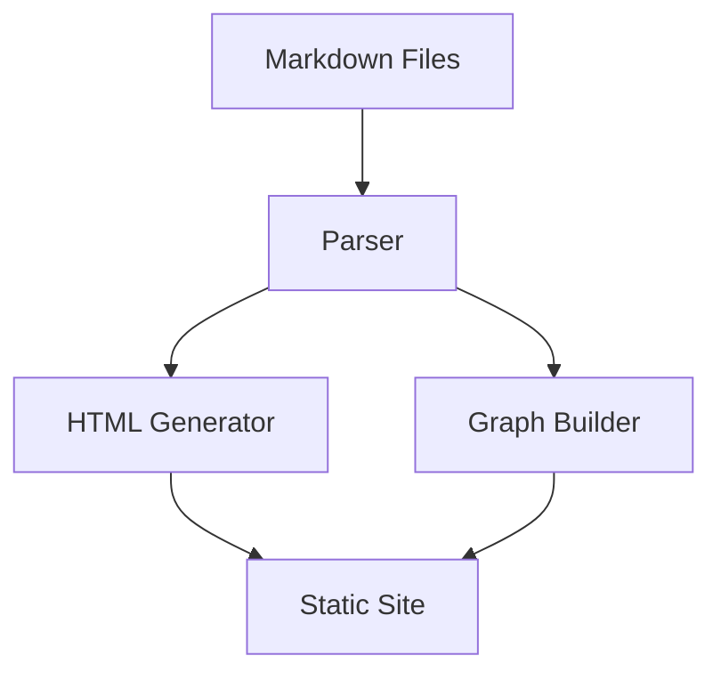
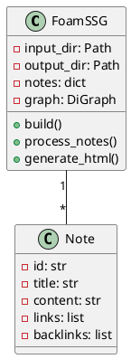

# Building a Foam-Style SSG

This project implements a static site generator inspired by [[tools/foam|Foam]] and [[tools/obsidian|Obsidian]].

## Features

### Graph Visualization

### Architecture

## Implementation Details

The system parses [[concepts/markdown]] files, extracts [[concepts/wiki-links]], and builds a graph of connections.

See [[programming/python-tips]] for implementation patterns used.